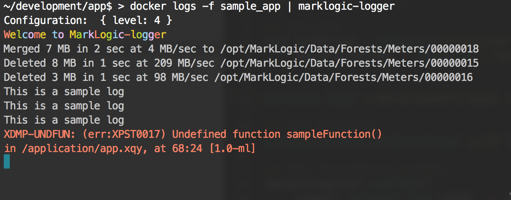

# markLogic-logger

A starter project for customizing the view of MarkLogic logs

## To install

```
npm i -g git+https://github.com/cgood92/marklogic-logger.git
```

## To use

Pipe your logs to the logger, such as:

```
docker logs -f jsp-ml | marklogic-logger
docker logs -f jsp-ml | LEVEL=2 marklogic-logger
```

Note: Default log level is 4



-------
Author: Clint Goodman